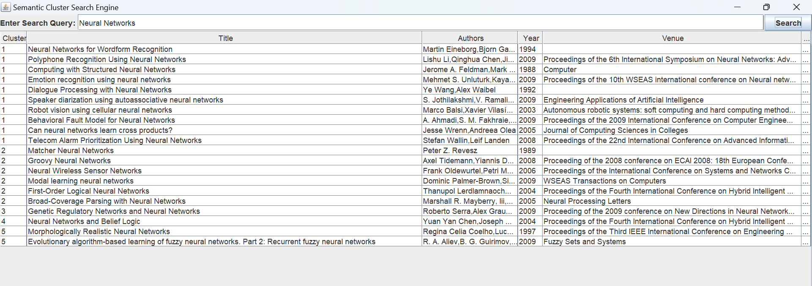

# Semantic Cluster Search Engine

A powerful semantic search engine that enhances traditional keyword-based retrieval by incorporating **semantic vector embeddings**, **PageRank citation importance**, and **KMeans++ clustering** for better result grouping and relevance ranking. Built with **Java**, **Lucene**, **Word2Vec**, and **Apache Commons Math**.

---

## Key Features

- **Lucene Text Search**:  
  Performs fast full-text search to retrieve papers using lexical (keyword-based) matching.
- **Word2Vec Semantic Matching**:  
  Converts both the query and paper titles to vector embeddings to compute semantic similarity.
- **PageRank Integration**:  
  Incorporates citation-based importance by computing PageRank scores for each paper.
- **Custom Ranking Score**:  
  Combines:
  - Lexical relevance (Lucene),
  - Semantic similarity (Word2Vec),
  - Citation importance (PageRank)  
    into a unified and more relevant ranking score.
- **KMeans++ Clustering**:  
  Organizes the top-ranked results into semantically coherent groups for easier navigation.
- **Java Swing UI**:  
  Enables users to input queries and interactively explore clustered results with metadata like title, authors, venue, year, and PageRank.

---

## Architecture Overview

```text
+------------------------+
|  User Input (Query)   |
+----------+-------------+
           |
           v
+------------------------+
|   Word2Vec Embedding   |
+------------------------+
           |
           v
+------------------------+       +------------------------+
| Lucene Text Search     |<----->|   Paper Lucene Index   |
+------------------------+       +------------------------+
           |
           v
+---------------------------------------------------+
| Score Combination (Lexical + Semantic + PageRank) |
+---------------------------------------------------+
           |
           v
+------------------------+
|     KMeans Clustering  |
+------------------------+
           |
           v
+------------------------+
|     Clustered Results  |
+------------------------+
           |
           v
+------------------------+
|    Swing-based UI      |
+------------------------+

```

## Screenshot

Here’s a preview of the application in action:

## 
